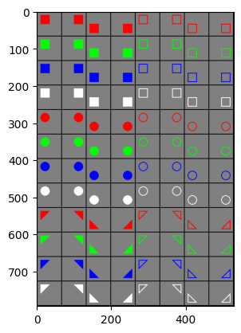

# Interpretability of ResNet neuron activations

This project aims are testing the interpretability approach discussed in the paper [Towards Monosemanticity: Decomposing Language Models With Dictionary Learning](https://transformer-circuits.pub/2023/monosemantic-features).

The autoencoder implementation and training is the same as in the paper.

Unlike the mentioned paper, this repository focuses on interpretability of image classification model instead of language models.
The classification task aims at discriminating images of shapes with the following attributes:
- `shape`: *circle*, *square*, or *triangle*,
- `color`: *red*, *green*, *blue*, or *white*,
- `fill`: *filled* or *empty*,
- `position`: *top-left*, *top-right*, *bottom-left*, or *bottom-right*.

These attributes aim at providing a space of features that are easy for humans to understand.
Two study cases are defined:
1. the 'basic' case consist on the analysis of the 96 possible images (training and testing) and
2. the 'augmented' case in which the set of 96 images is extended with small variations on rotation, color jitter, and blur and a proper split of the data in training, validation, and test is done.

Samples from the basic (left) and augmented (right) datasets.




The analyzed model is a simple ResNet architecture for solving a multiclass classification task for the 96 types of images.

Example of activations.


Example of the features that can be found.
Features are plotted based on color, shape type, and fill.
Clusters regarding color and fill are more


## Installation

Run:
```shell
pip install -r requirements.txt
```

## Run experiments

Start jupyter lab:
```shell
jupyter lab
```

Open the notebook `interpret_resnet.ipynb`.
